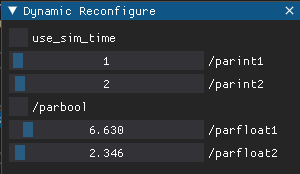

# Dynamic reconfigure for ROS2

It constantly refreshes the available ROS parameters and creates possibility to adjust them in real-time.



### Install 

Install ROS2 of your choice and install DearPyGUI `pip install dearpygui`. Then inside repo:
```
pip install -e .
```

### Usage

```
ros2 run dynamic_reconfigure dynamic_reconfigure
```

#### (optional) Add some ROS2 parameters

```
cd tests
python parameter_tester.py
```


